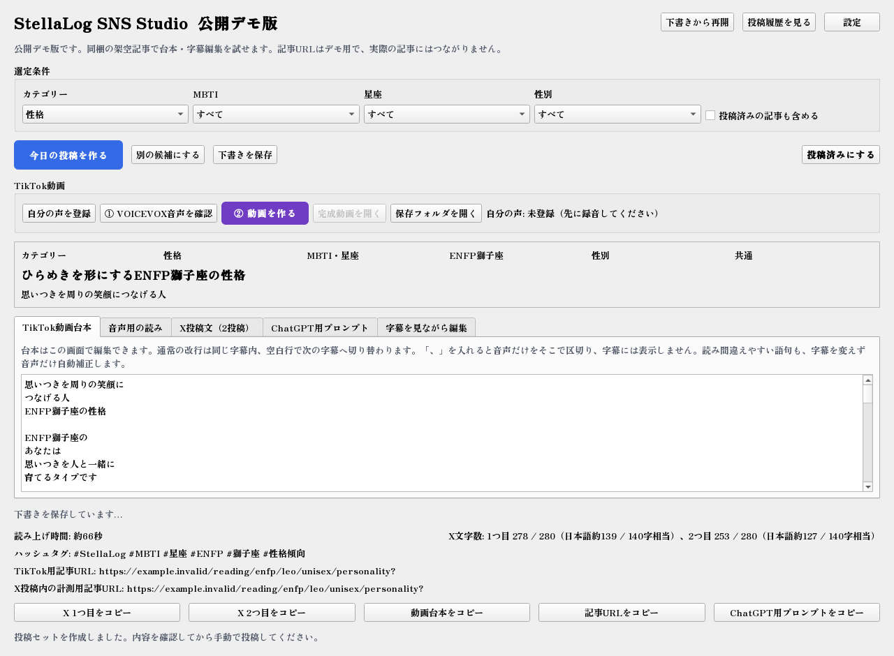
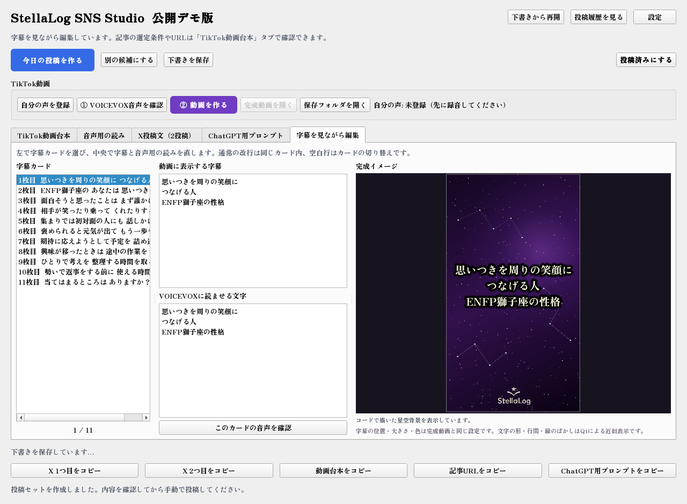

# StellaLog SNS Studio

記事からTikTok用の台本とX用の投稿文を作成し、字幕・ナレーション付きの縦型動画に仕上げるWindowsアプリです。記事選びから編集、下書き保存、投稿履歴の管理までを一つの画面で扱えます。

公開版には、画面と編集の流れを確認できる架空のサンプル記事7件を同梱しています。

## 制作の目的

記事をSNS向けに展開するときの、テーマ選び、文章の整形、字幕作成、音声とのタイミング調整をまとめて扱うために制作しました。投稿前に内容を確認・修正できる操作の流れを重視しています。

## 主な機能

- 条件に合う記事から、TikTok台本とXの2投稿文を生成
- 字幕カードを選び、完成イメージを見ながら表示文と読み上げ文を個別に編集
- 下書きの自動保存・再開と、投稿履歴による重複選択の防止
- ローカル音声合成とFFmpegによる、字幕・ロゴ付き縦型MP4の出力

[動画の出力例を見る（6秒・無音）](docs/demo/subtitle-demo.mp4)

## 使用技術

| 技術 | 用途 |
|---|---|
| Python 3.11以上 / PySide6 | デスクトップ画面とアプリの処理 |
| SQLite | 下書きと投稿履歴の保存 |
| VOICEVOX / Voicebox | PC内でのナレーション生成 |
| FFmpeg / ffprobe | 動画合成と音声・動画の情報取得 |
| pytest / GitHub Actions | 自動テストと継続的な検査 |

## 設計上の工夫

- **表示と読み上げを分離**：字幕の漢字表記を保ちながら、音声側の読み方だけを修正できます。カードごとの音声時間を使い、字幕の切り替えを合わせます。
- **編集を継続できる保存**：下書きと投稿済み履歴を分け、編集中の内容を自動保存します。生成済みの音声はキャッシュし、変更した部分を再生成します。
- **ローカル処理を中心に構成**：記事を読み取り専用で扱い、文章生成・編集・保存をPC内で行います。外部AI APIは使わず、SNSへの投稿は内容を確認した後に利用者が行います。

処理の構成は[アーキテクチャ概要](docs/architecture.md)にまとめています。

## 検証結果

- Windows環境で自動テスト **181件成功**。記事読み込み、投稿生成、字幕編集、下書き保存、音声キャッシュなどを検証しました。
- MP4の書き出しと、1080×1920・30fps・H.264/AACの出力形式を確認しました。
- GitHub Actionsでも自動テスト **181件成功**。Semgrepによる静的解析とGitleaksによる秘密情報検査も成功しました。

実施範囲と未確認項目は[検証記録](docs/verification.md)に記載しています。
