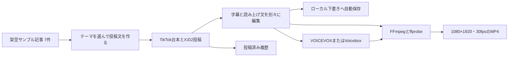

# アーキテクチャ概要

StellaLog SNS StudioはWindows上で動くPython 3.11以上、PySide6のデスクトップアプリです。文章生成や編集、保存はアプリ内で行い、ナレーションを作る場合だけPC内で起動した音声サービスへ接続します。

## 処理の流れ



通常の台本作成、文章編集、字幕編集、下書き保存はVOICEVOX、Voicebox、FFmpegに依存しません。ナレーションを作るときは、VOICEVOXまたはVoiceboxのうち利用者が用意したローカルサービスを使用します。MP4を書き出すときはFFmpegとffprobeが必要です。

## データの流れと保存

起動時は公開デモに同梱する架空サンプル7件を使います。URLには `example.invalid` を設定し、実在ページへの誘導を避けています。公開デモ版の設定・下書き・履歴などは次の専用フォルダーに保存します。

```text
%LOCALAPPDATA%\StellaLogSNSStudio\public-demo
```

この場所は開発版の保存先と分離されています。ソースコードにはAPIキーやパスワードを含めず、外部AI APIやSNS自動投稿先への通信も行いません。音声生成で使うVOICEVOXまたはVoiceboxは、利用者のPC内で起動するサービスです。

## 表示と動画

動画はプログラムで描く静止星空を背景に、Zen Antiqueの字幕とStellaLogロゴを重ねます。出力は縦型1080×1920、30fpsで、BGMは含みません。MP4生成時に別途FFmpegとffprobeを使います。

`docs/demo/subtitle-demo.mp4` は無音の短い書き出し例です。字幕表示の見本であり、ナレーションの収録例ではありません。
